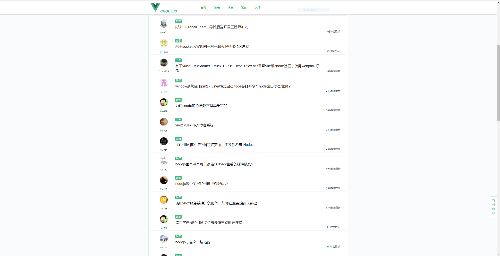
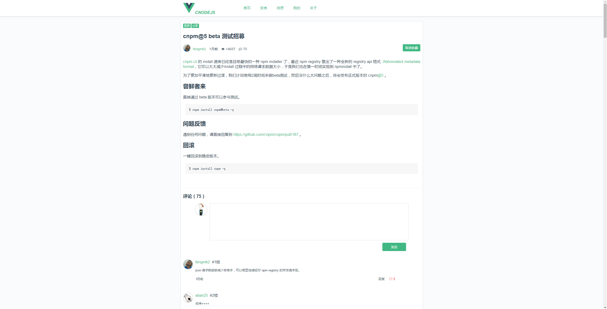
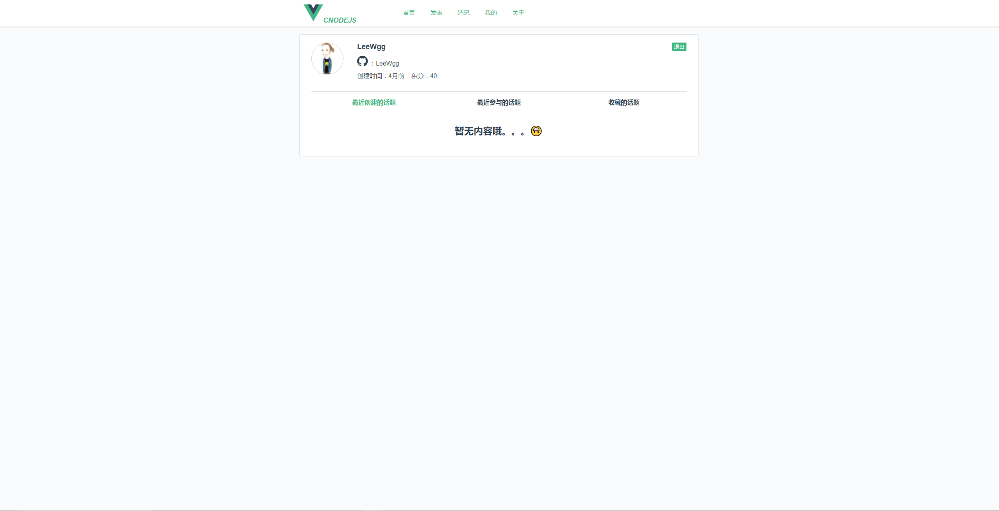

## 前言

####该项目是采用<a href="https://cnodejs.org/api">Cnode</a>社区提供的api，基于vue2.0重写，在此特别感谢！！！然后也要感谢<a href="https://github.com/shinygang" target="_blank"> https://github.com/shinygang </a>的vue-cnodejs项目给予我的启发。再一次说声谢谢！

## 感悟

``` bash
学习前端一年多，也看到Vue火起来，于是自己开始自学；
刚开始接触，真是觉得使用起来太方便，但还是有很多新的东西不是很了解，于是想这各种办法去学习去练习；
这个项目花了我一个星期时间，因为白天要上班，只能花晚上时间去做；
对于这个项目，我觉得挺适合新手vue入门的，包含了（vue-route，vuex，axios，webpack等基本知识），所以我希望新人可以多看看；
```

## 安装

``` bash
$ git clone https://github.com/LeeWgg/CNode.git
$ cd CNode
$ npm install或 cnpm install
```
## 截图





## 运行

``` bash
$ npm run dev
```
## 目录结构

``` bash
├── README.md          // 项目说明
├── build              // 构建服务和webpack配置
├── config             // 项目不同环境的配置
├── index.html         // 项目入口文件
├── package.json       // 项目配置文件
├── src                // 生产目录
│   ├── assets         // css js 和图片资源
│   ├── components     // 各种组件
│   ├── router         // 路由
│   ├── vuex           // vuex状态管理器
│   ├── app.vue        // 页面入口文件
│   └── main.js        // 程序入口文件，加载各种公共组件
```

For detailed explanation on how things work, checkout the [guide](http://vuejs-templates.github.io/webpack/) and [docs for vue-loader](http://vuejs.github.io/vue-loader).
